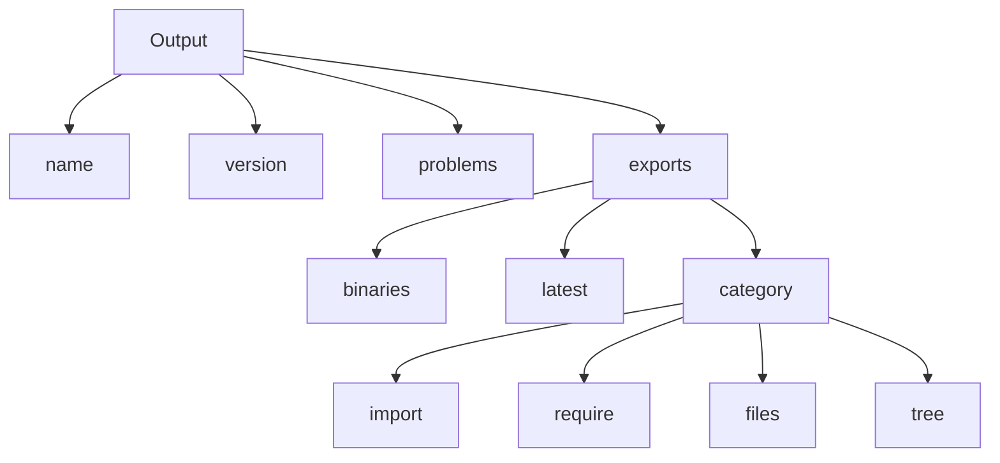

# list-exports <sup>[![Version Badge][npm-version-svg]][package-url]</sup>
[![github actions][actions-image]][actions-url]
[![coverage][codecov-image]][codecov-url]

---

## 📦 About This Repository

This repository is a **monorepo** that hosts two related packages:  
- **`list-exports`** — a Node.js library that analyzes a `package.json`, lists all its export specifiers, and provides validation and diagnostics.  
- **`ls-exports`** — a command-line interface (CLI) tool that offers the same functionality as `list-exports`, accessible directly from the terminal.

These packages help developers inspect and troubleshoot the `exports` field in `package.json`, either programmatically (via the library) or interactively (via the CLI).

---

## 🗺️ Output Structure Diagram



---

## ⚙️ Options

Besides the required `package.json` path, you can also pass an options object:

- `node`: either `true` (reads `engines.node`), or a semver range string for Node versions to target. Defaults to the current Node version.

---

## 🖥️ CLI Usage Example

You can also use the CLI tool located in:
```
./packages/ls-exports/bin/ls-exports
```

Example:
```bash
node ./packages/ls-exports/bin/ls-exports path ./packages/list-exports --json
```

---

## 📄 API Example

```js
const listExports = require('list-exports');

listExports('./package.json', { node: true })
  .then((data) => {
    console.log(JSON.stringify(data, null, 2));
  })
  .catch((err) => {
    console.error(err);
    process.exit(1);
  });
```

---

## 🧪 Running Tests

To run the tests:
```bash
npm install
npm test
```

Make sure tests pass before submitting a PR.

---

## 📦 Packages

This monorepo contains the following packages:

- [`list-exports`](./packages/list-exports/) — core library that lists export specifiers from `package.json`.  
  [View README](./packages/list-exports/README.md)

- [`ls-exports`](./packages/ls-exports/) — CLI tool for listing exports.  
  [View README](./packages/ls-exports/README.md)

---

## 📁 Repository Structure

- `.github/` → GitHub workflows, funding info
- `packages/`
  - `list-exports/` → core library
    - `index.js`, `package.json`, `README.md`
  - `ls-exports/` → CLI tool
    - `exportsTable.js`, `getPackageJSONPath.js`, `table.js`, `package.json`, `README.md`
- `tests/` → test files and fixtures
  - `add-fixture.mjs`, `conditions.js`, `conditions-expected.js`, `index.js`, `package.json`
- Root configs:
  - `.eslintrc`, `.eslintignore`, `.npmrc`, `.gitignore`
- `LICENSE`
- `README.md`

---

## 🙋‍♀️ Contributing

We welcome contributions! Please:
- Fork the repo and create your branch from `main`.
- Run `npm install` to install dependencies.
- Run tests with `npm test` before opening a PR.
- Follow the existing code style and conventions.

---

## 🙌 Shoutouts

Thanks to [Jordan Harband](https://github.com/ljharb) and all contributors for maintaining this project.

---

[package-url]: https://npmjs.org/package/list-exports  
[npm-version-svg]: https://versionbadg.es/ljharb/list-exports.svg  
[npm-badge-png]: https://nodei.co/npm/list-exports.png?downloads=true&stars=true  
[license-image]: https://img.shields.io/npm/l/list-exports.svg  
[license-url]: LICENSE  
[downloads-image]: https://img.shields.io/npm/dm/list-exports.svg  
[downloads-url]: https://npm-stat.com/charts.html?package=list-exports  
[codecov-image]: https://codecov.io/gh/ljharb/list-exports/branch/main/graphs/badge.svg  
[codecov-url]: https://app.codecov.io/gh/ljharb/list-exports/  
[actions-image]: https://img.shields.io/endpoint?url=https://github-actions-badge-u3jn4tfpocch.runkit.sh/ljharb/list-exports  
[actions-url]: https://github.com/ljharb/list-exports/actions  
[category]: https://github.com/inspect-js/node-exports-info#categories